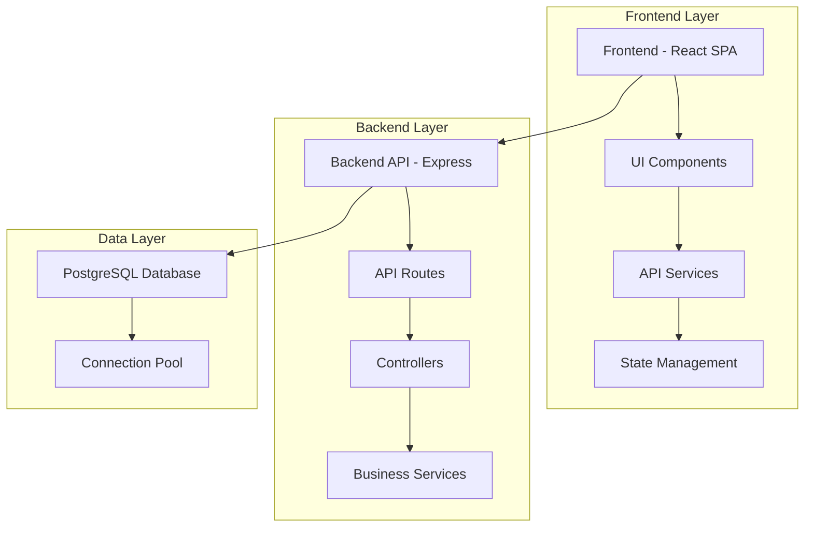

# Architecture Blueprint

## 1. System Overview

The Task Manager application follows a **modern full-stack architecture** with clear separation between frontend and backend layers. The architecture emphasizes type safety, performance, and scalability:

- **Frontend**: Next.js 15 with App Router, Server Components, and Server Actions
- **Backend**: NestJS 10 with TypeORM, modular architecture
- **Database**: PostgreSQL for data persistence
- **Cache**: Redis for token revocation and response caching
- **Deployment**: Decoupled architecture (separate frontend/backend deployments)

This approach provides:
- ✅ Type safety across the stack
- ✅ Server-side rendering for performance
- ✅ Multi-layer caching for speed
- ✅ Modular, maintainable code
- ✅ Horizontal scalability
- ✅ Future-proof architecture

## 2. Tech Stack

| Layer | Technology | Justification |
|-------|------------|---------------|
| **Frontend** | Next.js 15 | Full-stack React framework with SSR, routing, and optimization |
| **Frontend** | React 19 | Latest React with Server Components support |
| **Frontend** | TypeScript | Type safety and better developer experience |
| **Frontend** | CSS Modules | Scoped styling for components |
| **Frontend** | Server Actions | Progressive enhancement for mutations |
| **Backend** | NestJS 10 | Enterprise-grade Node.js framework with DI and modules |
| **Backend** | TypeORM | Type-safe database operations |
| **Backend** | PostgreSQL | Relational database for ACID compliance |
| **Backend** | Redis | Caching and token revocation |
| **Backend** | Swagger | Auto-generated API documentation |
| **Shared** | TypeScript Types | Shared types across frontend and backend |
| **Development** | Docker | Containerization for PostgreSQL and Redis |
| **Development** | ESLint + Prettier | Code quality and formatting |
| **Deployment** | Vercel | Optimized Next.js hosting with CDN |
| **Deployment** | Railway/Render | Backend hosting with managed infrastructure |

## 3. System Diagram



## 4. Data Flow

### Request Flow (Create Task)
1. **User Action**: User submits task form in React frontend
2. **Frontend Processing**: React component calls API service (Native Fetch API)
3. **HTTP Request**: POST request sent to `/api/tasks` endpoint
4. **Backend Routing**: Express routes request to task controller
5. **Validation**: Middleware validates request body (title required)
6. **Business Logic**: Controller calls task service for business logic
7. **Database Operation**: Service executes INSERT query via connection pool
8. **Response**: Database returns created task with ID
9. **API Response**: Controller sends JSON response (201 Created)
10. **Frontend Update**: React updates state with new task
11. **UI Refresh**: Task list re-renders with new task

### Query Flow (Filter Tasks)
1. **User Action**: User clicks filter button (e.g., "Completed")
2. **Frontend Processing**: React updates filter state
3. **HTTP Request**: GET request sent to `/api/tasks?status=completed`
4. **Backend Processing**: Express routes to task controller
5. **Database Query**: Service executes SELECT with WHERE clause
6. **Response**: Database returns filtered task array
7. **API Response**: Controller sends JSON response (200 OK)
8. **Frontend Update**: React updates state with filtered tasks
9. **UI Refresh**: Task list displays only completed tasks

### Error Flow
1. **Error Occurs**: Database connection failure or validation error
2. **Error Handling**: Middleware catches error
3. **Error Response**: Controller sends error JSON (400/500 status)
4. **Frontend Handling**: React catches error and displays error message
5. **User Feedback**: User sees error notification

---

## 5. Folder Structure

```
task-manager/
├── frontend/
│   ├── src/
│   │   ├── components/          # Button, Input, TaskList, TaskItem, TaskForm, TaskFilter
│   │   ├── services/            # api.js, taskService.js
│   │   ├── context/             # TaskContext.jsx
│   │   ├── pages/               # HomePage.jsx
│   │   ├── App.js
│   │   └── index.js
│   └── package.json
│
├── backend/
│   ├── src/
│   │   ├── config/              # database.js, env.js
│   │   ├── controllers/         # taskController.js
│   │   ├── services/            # taskService.js
│   │   ├── routes/              # taskRoutes.js
│   │   ├── middleware/          # cors.js (native CORS middleware)
│   │   ├── app.js
│   │   └── server.js
│   ├── migrations/              # (empty, for future use)
│   └── package.json
│
├── database/
│   ├── schema.sql
│   ├── docker-compose.yml
│   ├── setup.sh
│   ├── setup.ps1
│   └── README.md
│
└── docs/                        # Documentation
```

## 6. Integration Points

### API Endpoints

| Method | Endpoint | Description | Protocol |
|--------|----------|-------------|----------|
| GET | `/api/tasks` | Get all tasks | HTTP/REST |
| GET | `/api/tasks?status=pending` | Filter tasks by status | HTTP/REST |
| GET | `/api/tasks/:id` | Get task by ID | HTTP/REST |
| POST | `/api/tasks` | Create new task | HTTP/REST |
| PUT | `/api/tasks/:id` | Update task | HTTP/REST |
| DELETE | `/api/tasks/:id` | Delete task | HTTP/REST |

### Communication Protocols
- **Frontend ↔ Backend**: HTTP/REST (JSON)
- **Backend ↔ Database**: PostgreSQL protocol (via pg client)


### Response Format
- **Success**: `{ success: true, data: {...}, message: "..." }`
- **Error**: `{ success: false, error: { code: "...", message: "..." } }`

## 7. Security & Performance Notes

### Security Considerations

#### MVP Security
- **Input Validation**: Validate all user inputs on both frontend and backend
- **SQL Injection Prevention**: Use parameterized queries (pg library)
- **CORS Configuration**: Restrict allowed origins to frontend URL
- **Environment Variables**: Store sensitive data in environment variables
- **Error Handling**: Don't expose sensitive information in error messages


### Performance Optimization

#### Performance Optimization (MVP)
- **Database Indexing**: Index `status` and `created_at` columns
- **Connection Pooling**: Reuse database connections
- **React.memo**: Memoize components to prevent unnecessary re-renders
- **Query Optimization**: Optimize SQL queries

---

**Document Version**: 3.0  
**Last Updated**: 2025-01-XX

